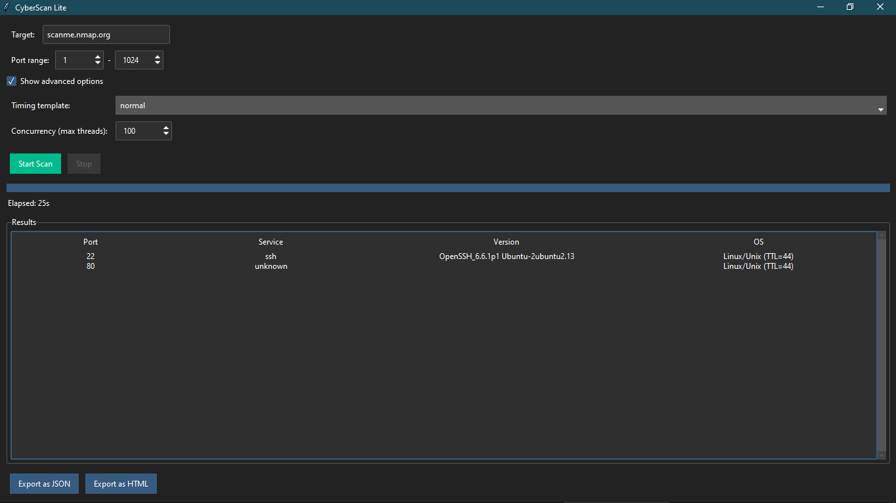

# CyberScan Lite

**CyberScan Lite** is a lightweight, user‑friendly network scanner that does not require external tools like Nmap. It scans a single target (IP or hostname) for open ports, identifies services via banner grabbing, guesses the operating system using packet analysis, and exports results in HTML and JSON formats.

## Preview 

###1. Main Windows


###2. Html Report 


## Features

- Simple, clean GUI built with `tkinter` and `ttkbootstrap`.
- Automatic host‑alive check (ping) before scanning.
- Configurable port range and advanced timing/concurrency options.
- Service detection using a built‑in YAML database of signatures.
- OS fingerprinting based on TTL from ping responses.
- Real‑time results table with progress bar.
- Export to JSON and styled HTML report.

## Requirements

- Python 3.10 or higher
- Dependencies listed in
  - `requirements.txt`:
  - `ttkbootstrap`
  - `pyyaml`
  - `jinja2`

## Installation

1. Clone or download this repository.
2. Navigate to the project folder.
3. Install dependencies:

   ```bash
   pip install -r requirements.txt
   ```
4. Run the application:

   ```bash
   python main.py
   ```
   
## Usage

1. Enter a target IP address or domain name.
2. Adjust port range (default 1–1024).
3. Optionally, show advanced options to set:
   - **Timing template**: controls delay between packets (paranoid = slow, insane = no delay).
   - **Concurrency**: number of parallel threads.
4. Click **Start Scan**. The progress bar and timer will update.
5. Stop a running scan with the **Stop** button.
6. After scan, use the **Export** buttons to save results.

## Limitations

- OS fingerprinting is based only on TTL from ping; it may be inaccurate behind firewalls or load balancers.
- Service detection uses banner grabbing; encrypted services (HTTPS) may not yield a readable banner.
- The scanner uses a TCP connect scan; it will not detect filtered ports (they appear as closed).
- No support for scanning multiple targets or CIDR ranges.

## Customization

- Service signatures can be extended by editing `data/service_signatures.yaml`.
- OS fingerprint rules can be extended in `data/os_fingerprints.yaml`.

## License

This project is open‑source and available under the MIT License.

---

## ⚠️ DISCLAIMER & LEGAL NOTICE

**IMPORTANT: Unauthorized network scanning is ILLEGAL.**

### Authorized Use Only
This tool is provided **ONLY for:**
- ✅ Security research and learning
- ✅ Testing networks **you own or have written permission to scan**
- ✅ Authorized penetration testing engagements
- ✅ Cybersecurity students learning network basics

### Prohibited Use
Do **NOT** use this tool to:
- ❌ Scan networks you don't own
- ❌ Perform port scanning without explicit written permission
- ❌ Conduct unauthorized penetration testing
- ❌ Any malicious purpose

### Legal Consequences
Unauthorized port scanning is illegal in most jurisdictions:
- **India:** ITA Section 66 (Jail + ₹5 Lakh fine)
- **USA:** CFAA (Up to 10 years prison)
- **EU:** Similar cybercrime laws apply

### Data Stays Local
- All scans remain on your computer
- No data is uploaded or shared
- Results are stored locally only
- **However:** Unauthorized use is still illegal

---

**By using this tool, you agree to use it only for authorized testing of systems you own or have explicit written permission to scan.**
